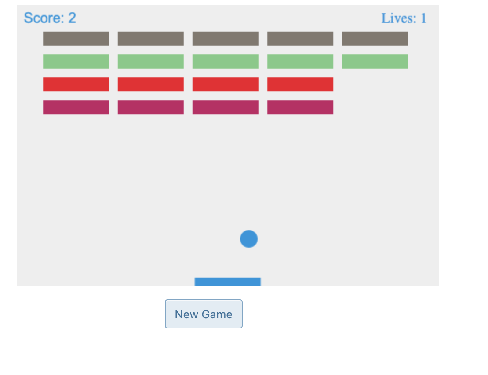

# Breakout (the game)

## What is this game?

Breakout is an arcade video game developed and published by Atari, Inc. and released on May 13, 1976. It was designed by Steve Wozniak, based on conceptualization from Nolan Bushnell and Steve Bristow who were influenced by the seminal 1972 Atari arcade game Pong. **In Breakout, a layer of bricks lines the top third of the screen and the goal is to destroy them all by repeatedly bouncing a ball off a paddle into them.** The arcade game was released in Japan by Namco. Breakout was a worldwide commercial success, among the top five highest-grossing arcade video games of 1976 in both the United States and Japan. The 1978 Atari VCS port uses color graphics instead of a monochrome screen with colored overlay. [Wiki Breakout (video game)](https://en.wikipedia.org/wiki/Breakout_(video_game)#:~:text=Breakout%20is%20an%20arcade%20video,1972%20Atari%20arcade%20game%20Pong.&text=The%20arcade%20game%20was%20released%20in%20Japan%20by%20Namco.)

## Why was it made?

This game of breakout was made to allow the creator (me) to practice writing JS and learn about the concepts behind OOP, classes, inheritance along with bundling he code and writting this nice ReadMe in Markdown. 

### Image

### To Play

- [x] Open the game in a live server through your VSCode
- [x] Change the colours with the "New Game" button
- [x] Move the paddle with your arrows or the mouse
- [x] Clear out the bricks with that little ball

### Made with 

- Javascript
- Written on VSCode
- Used 

## Steve Wozniak about Breakout:

>Well, Steve Jobs came to me and he said that Atari wanted me to design this game, and I had only four days to do it. They had hired me, even though I didn’t have a college degree, and I thought I was the greatest designer. But four days? I didn’t think I could do it. 

>I went four days with no sleep. ===Steve and I both got mononucleosis, the sleeping sickness, and we delivered a working Breakout game===. That was obviously a big classic. Supposedly, the Atari engineers couldn’t understand my design. It was just so beautiful and advanced, but they couldn’t get it. I never got to talk to them. I don’t know if they knew that I did it. They paid Steve Jobs, and then he paid me half the money, supposedly. *Steve Wozniak*
[How Steve Wozniak's Breakout Defined Apple's Future](https://www.gameinformer.com/b/features/archive/2015/10/09/how-steve-wozniak-s-breakout-defined-apple-s-future.aspx)

